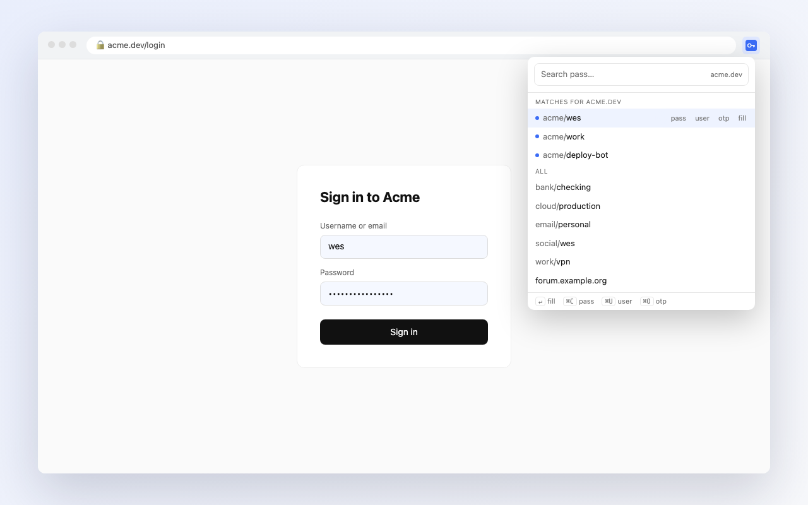

# passr for Chrome


A small, fast Chrome extension for [`pass`](https://www.passwordstore.org/), the standard unix password manager. Open it on any login page and the matching entries are already at the top. Press Enter to fill.

It's the browser companion to the [passr TUI](https://github.com/wes/passr), and it works the same way: passr is only a front end. It reads your existing store with `gpg`, stores nothing, and never touches the network.



## Install

Installation has two parts.

**1. The helper.** A browser extension can't run `gpg` itself, so a small Python helper does it (standard library only). To install:

```sh
curl -fsSL https://raw.githubusercontent.com/wes/passr-chrome/main/install.sh | bash
```

Or run `./install.sh` from a clone. The helper goes into `~/.local/share/passr-chrome`. It's registered with every Chromium browser the script finds: Chrome, Brave, Edge, Vivaldi, Arc and Chromium, on macOS and Linux.

It needs `python3`, `gpg` and a password store. On Linux it also needs one of `wl-clipboard`, `xclip` or `xsel` for copying.

**2. The extension.** Install it from the Chrome Web Store *(link coming soon)*, or load it unpacked: open `chrome://extensions`, turn on **Developer mode**, click **Load unpacked**, and pick the `extension/` folder.

To uninstall the helper, run `./install.sh --uninstall`.

## Use

Press **⌥⇧P** or click the icon. To change the shortcut, go to `chrome://extensions/shortcuts`.

| Key | Action |
| --- | --- |
| type | search (space-separated terms, all must match) |
| ↑ ↓ / ⌃N ⌃P | move |
| ↵ | fill username + password into the page |
| ⇧↵ or ⌘C | copy password |
| ⌘U | copy username |
| ⌘O | copy OTP code |

On Linux, use Ctrl in place of ⌘. The clipboard clears after 45s, or after `$PASSWORD_STORE_CLIP_TIME` if you set it, as long as nothing else has been copied in the meantime.

### Entry format

passr follows the usual pass conventions:

```
correct-horse-battery-staple
login: wes@example.com
otpauth://totp/Example:wes?secret=JBSWY3DPEHPK3PXP&issuer=Example
```

- **Password:** the first line.
- **Username:** a `login:`, `username:`, `user:` or `email:` line. If there's none, the entry's filename is used (`github/wes` → `wes`).
- **OTP:** an `otpauth://` line. passr generates the codes itself, so the `pass-otp` extension isn't needed.

### Site matching

Matching uses the entry path, so all of these work on the right sites:
- `accounts.example.com`
- `example.com/wes`
- `example/wes`
- `aws/prod` on `signin.aws.amazon.com`

A few brand aliases (bsky → bluesky, etc.) live in [`extension/match.js`](extension/match.js).

## GPG passphrase

When your key is locked, passr asks for the passphrase in its own dialog. It uses your GUI pinentry if you have one (`pinentry-mac`, `pinentry-gnome3`, `pinentry-qt`), or a native macOS dialog otherwise. gpg-agent then caches the passphrase as usual, and your gpg-agent config is left untouched.

gpg-agent forgets the passphrase after 10 minutes idle (and after 2 hours at most). To be asked less often, raise both limits in `~/.gnupg/gpg-agent.conf`:

```
default-cache-ttl 28800
max-cache-ttl 86400
```

## Privacy

Nothing leaves your machine. See [PRIVACY.md](PRIVACY.md).

## Development

```
extension/        MV3 popup + background worker (host requests), no content scripts
host/             native messaging host (Python, stdlib only)
install.sh        installs/registers the host
scripts/build.sh  builds dist/passr-<version>.zip for the Web Store
scripts/icons.py  renders the icon set
scripts/screenshots.sh  renders store images from store/*.html
```

`extension/manifest.json` has a `key` that pins the unpacked extension ID (`nhkiodgoijpenbjclggfpgecbianeicp`), so the helper recognizes it. `scripts/build.sh` strips the key for the store build. The store's ID is listed as `STORE_ID` in `install.sh`.

## License

MIT
